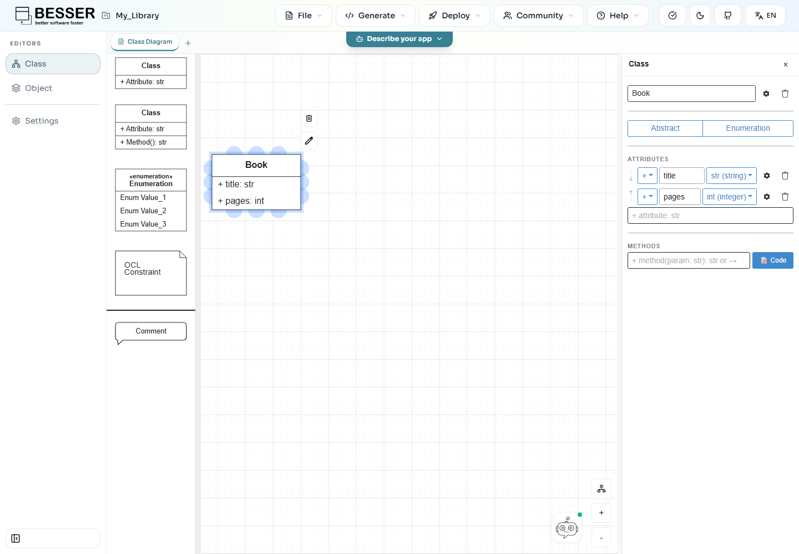
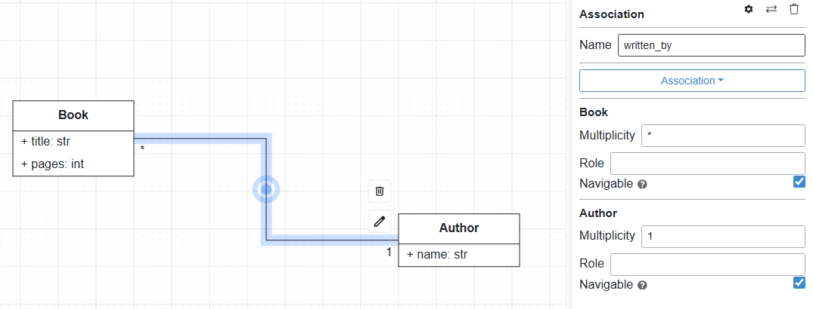
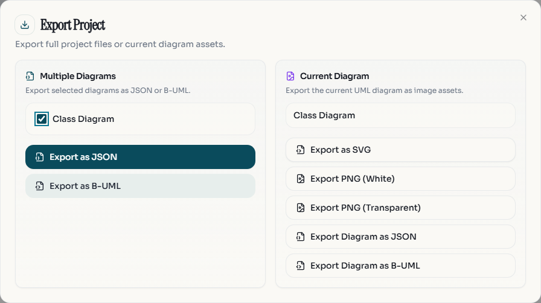

Your first project
==================

**Goal:** model books and authors, check the diagram, download Python classes,
and save the project. You need only a browser, and this tutorial makes no AI
calls.

Create the project
------------------

.. figure:: ../images/wme/v8/interface-choice.png
   :width: 640
   :alt: Welcome screen with Model it and Describe it choices

   **Model it** opens the visual modeling workflow used in this tutorial.

1. Open `editor.besser-pearl.org <https://editor.besser-pearl.org>`_.
2. On the welcome screen choose **Model it**. If a project is already open,
   choose **File > New Project**, then **Low-code**.
3. Enter ``My Library`` as the name, select **Data Modeler** as the modeling
   perspective, and click **Create Project**. Spaces in the name become
   underscores, so the workspace title is ``My_Library``.

.. figure:: ../images/wme/v8/new-project.png
   :width: 640
   :alt: Project details with Low-code view and Data Modeler perspective selected

   Create ``My Library`` with the **Data Modeler** perspective.

You should see an empty canvas and a palette of class-diagram elements.

Add two classes
---------------

Drag a **Class** from the palette onto the canvas and double-click it.
Name it ``Book``. Rename the default attribute to ``title`` and leave its
type as **str (string)**. Add the next line in the attribute input and press
Enter:

.. code-block:: text

   + pages: int

   The ``Book`` class and its attributes in the properties panel.

Add another class named ``Author``. Rename its default attribute to ``name``
and leave its type as ``str``:

.. code-block:: text

   + name: str

You should now have two class boxes. Their attribute lines describe the
fields the generator will put in the source code.

Connect books to authors
------------------------

1. Select ``Book`` and drag from a connection point to ``Author``.
2. Double-click the line to open its properties.
3. Choose **Association** and name it ``written_by``.
4. Set the end at ``Book`` to ``*`` and the end at ``Author`` to ``1``.
   Leave both ends navigable.

This means an author may have many books, and every book has one author.
Multiplicity is read at the opposite end: the ``1`` next to ``Author`` tells
you how many authors one book has.

   Set the two multiplicities in the association properties panel. Both
   **Navigable** boxes are selected in this example.

Check the model
---------------

Click **Quality Check** in the top bar. Resolve any errors before continuing.
For example, give two classes different names if the check reports a duplicate.

Download code
-------------

Open **Generate > OOP > Python Classes**. The downloaded
``.py`` file should define ``Book`` and ``Author``, their attributes, and their
association.

.. figure:: ../images/wme/v8/generate-python.png
   :width: 700
   :alt: Generate menu with OOP expanded and Python Classes available

   Choose **OOP > Python Classes** to download this model as Python code.

This output is Python classes, not a running backend. For an API choose
the backend generator; for a full web application you also need a linked
GUI model. :doc:`../user-guide/generate-code` explains the options.

Save a project copy
-------------------

Use **File > Export Project**, include the class diagram, and choose
**Export as JSON**. Keep this file so you can import the project in another
browser or after clearing site data.

   **Export as JSON** under **Multiple Diagrams** saves the selected diagrams
   as a project backup.

.. important::

   Automatic saving uses this browser's site storage. Downloading generated
   code does not back up your project.

Next steps
----------

* :doc:`../user-guide/diagrams/gui-diagram`: add screens to the data model.
* :doc:`../user-guide/ai-assistant`: describe changes in natural language.
* :doc:`../user-guide/spec-driven-agent`: generate a customised application.
* :doc:`../user-guide/projects`: import, export, and organise diagrams.
