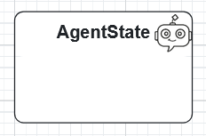
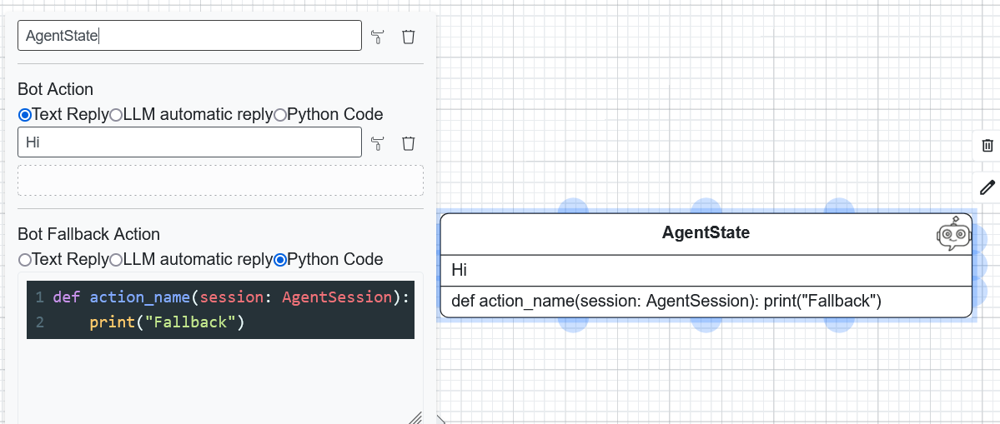
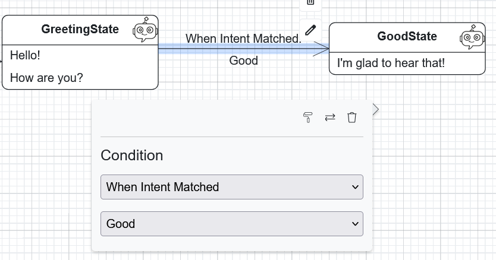
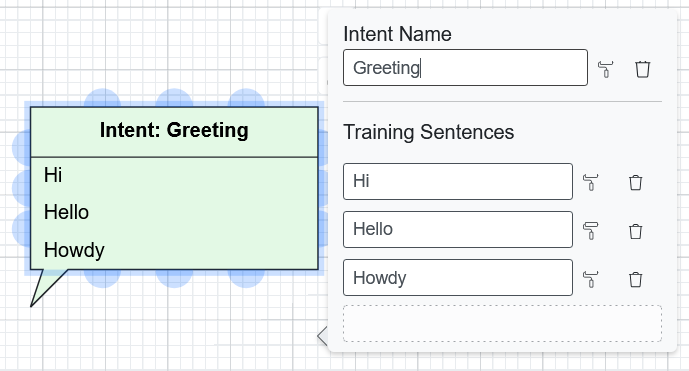
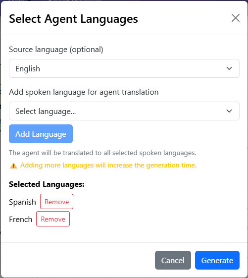

Agent Diagrams
==============

Agent diagrams are used to design conversational agents and their behaviors, supporting the definition of
`agent models <https://besser.readthedocs.io/en/latest/buml_language/model_types/agent.html>`_.

.. note::

   Agent-level components — LLMs, Intents, Tools, Skills, Workspaces, RAG databases, SQL databases, and
   GUIs — are managed on the :doc:`../agent-components` page rather than on the diagram canvas.
   Runtime settings (platform, intent recognition, ``config.yaml``) are on the
   :doc:`../agent-runtime` page.

Agent States
------------

AgentStates represent the different conditions or statuses that an agent can be in.

Double-click an AgentState to edit its body:

State Body Actions
~~~~~~~~~~~~~~~~~~

Each state body is a sequence of one or more actions, run in order. Drag an action to reorder
it, and click it to expand its fields.

To add an action, use the **New action** picker below the body: choose a tab, pick an action
type, then click **Add** (the button shows the chosen type, for example **Add Text**). The tabs
group the action types:

- **Simple Replies**: **Text**, **Speech**, **Options**, **GUI**, **Location**, **HTML**,
  **Markdown**, **File**, **Image**, **Dataframe**, **Plotly**.
- **AI Replies**: **LLM**, **LLM Chat**.
- **Data Query**: **RAG**, **SQL Query**, **Web Crawl + LLM**.

Several AI and data actions share these fields:

- **LLM**: the LLM to use; **(use default)** uses the agent's default LLM (see
  :doc:`../agent-components`).
- **Input (sent to LLM)** (or **Input (sent to RAG)**, **Input (sent to DB + LLM)**): **Last
  user message** (default) sends the user's latest message; **Custom prompt** sends a template
  instead. Tick **Replace {vars} at runtime** to fill ``{user_message}`` and ``{key}``
  placeholders from the session.
- **Store result in session (optional)**: a session key under which the result is stored, to
  reuse it in later states.
- **Send as agent reply**: untick to only store the result without sending it to the user.

**Text**

Sends a plain text message.

- **Message**: the text to send.
- **Interpolate session variables**: replaces ``{key}`` placeholders with the session value
  stored under that key; ``{user_message}`` is the current user message.

**LLM**

Sends a prompt to an LLM and replies with the generated text.

- **LLM**, **Input (sent to LLM)**, **Store result in session (optional)**, **Send as agent
  reply**: see above.
- **System message**: optional system-level instruction. Tick **Interpolate {vars} in system
  message** to fill session placeholders.

**LLM Chat**

Like **LLM**, but in conversational mode: the LLM receives the message history, which suits
multi-turn dialogue. It needs an OpenAI or Hugging Face LLM, and offers the **LLM**, **System
message**, **Store result in session (optional)** and **Send as agent reply** fields.

**RAG**

Answers from a RAG database registered on the :doc:`../agent-components` page, with the LLM
set on that database.

- **RAG database**: the database to query.
- **Prompt**: optional prompt passed to the RAG call. Tick **Interpolate {vars} in prompt** to
  fill session placeholders.
- **Input (sent to RAG)**, **Store result in session (optional)**, **Send as agent reply**: see
  above.

**SQL Query**

Runs a query on a SQL database and replies with the result. Click **Initialize database
action** to set it up, then fill in:

- **Select a Database**: **Default (using the app DB)**, or **Custom** with a **Custom database
  name**, which must match the **Name** of an entry in **SQL Databases** on the
  :doc:`../agent-components` page.
- **DB operation**: **Any**, **SELECT**, **INSERT**, **UPDATE** or **DELETE**.
- Query mode: **LLM query** (an LLM writes the query from the user's request; set the **LLM**
  and **Input (sent to DB + LLM)**) or **SQL** (enter the SQL query yourself).
- **Store result in session (optional)**, **Send as agent reply**: see above.

**Web Crawl + LLM**

Crawls a website and uses an LLM to answer from the scraped content.

- **Initial URL**: where the crawl starts.
- **Base URL prefix (optional)**: restricts the crawl to URLs with this prefix.
- **Max depth** / **Max pages**: limit the crawl.
- **Crawl format**: **Markdown** (default), **Plain text** or **HTML**.
- **Run crawl (uncheck to reuse cached result)**: untick to reuse the crawl result already in
  the session.
- **No-crawl error message**: sent when no crawl data is available.
- **System message prefix (optional)**: text placed before the crawled content in the LLM system
  message. Tick **Interpolate {vars} in system message prefix** to fill session placeholders.
- **LLM**, **Store result in session (optional)**, **Send as agent reply**: see above.

**GUI**

Sends a GUI registered on the :doc:`../agent-components` page as an interactive panel in the
chat (for example, a form). Select it in **GUI**. When the user submits a form, the agent can
react with a *Form Submitted* transition (see `Transitions`_ below).

**WebSocket replies**

These actions need the **WebSocket** platform, set in **Agent Runtime** on the
:doc:`../agent-runtime` page. They are shown in red as a reminder while another platform is
selected.

- **Markdown** / **HTML**: sends a Markdown- or HTML-formatted **Message**.
- **Speech**: converts the **Message** to speech and sends it as audio, with an optional
  **Audio speed (optional)**.
- **Options**: sends selectable options, one per line in **Options (one per line)**.
- **Location**: sends a location pin from a **Latitude** and a **Longitude**.
- **File**, **Image**, **Dataframe**, **Plotly**: send a file, an image, a pandas DataFrame
  (as a table) or a Plotly chart. The generated code contains a placeholder: before the state is
  reached, your code must assign the object to send (``reply_file_obj``, ``reply_image_arr``,
  ``reply_df`` or ``reply_plot``).

Markdown, HTML and Speech offer **Interpolate {vars} in message** to fill session placeholders.

**Custom Python code**

Instead of a list of actions, a body can be written in Python: switch the body from
**Predefined** to **Custom (Python)**, then click **Initialize Python code**. The function
receives ``session`` as its only argument. Agents with custom Python bodies cannot be tried in
the :doc:`../agent-simulation` with the default settings.

Tick **Enable Fallback Body** to give the state a **Fallback Body**, edited the same way as the
body.

Transitions
-----------

Transitions define how the agent moves between states. The transition editor has two tabs,
**Predefined transition** and **Custom transition**. The predefined types are:

*   **Auto**: fires when the state body finishes, without waiting for user input.
*   **Intent Matched**: fires when the user's message matches the selected intent.
*   **No Intent Matched**: fires when none of the intents match.
*   **Variable Operation Matched**: fires when a session variable satisfies a comparison
    (variable, operator, and target value).
*   **File Received**: fires when the user uploads a file; optionally restrict it to some file
    types.
*   **Form Submitted**: fires when the user submits a GUI form. Select one of the GUIs that have
    **Is Form** ticked on the :doc:`../agent-components` page, or keep **Any form submission**.

A **Custom transition** uses an explicit **Event** and free-form **Conditions** (click **Add
condition**).

Intents
-------

Intents represent the user's goals or vocabulary. Each intent requires a name and a list of
training sentences and is managed on the :doc:`../agent-components` page.

Generating the Agent
--------------------

Once designed, you can generate a deployable agent:

1.  Click **Generate Code**.
2.  Select **BESSER Agent**.
3.  Choose the **Source Language** (of your model) and **Target Language** (for the agent's communication).

Supported languages include English, German, Spanish, French, Luxembourgish, and Portuguese.

To test the agent interactively without leaving the editor, see :doc:`../agent-simulation`.
