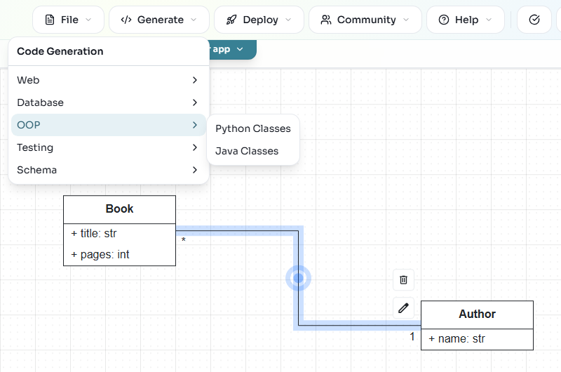

Generate code from a diagram
============================

**Goal:** download deterministic generated code from a reviewed model.
This uses the **Generate** menu and does not need an AI key.

1. Open the diagram you want to generate from.
2. Click **Quality Check** and fix the model errors it reports.
3. Open **Generate** and choose a target compatible with the diagram.
4. Complete any generator settings and download the result.
5. Read the generated project's run instructions before starting it locally.

   For Python classes, choose **Generate > OOP > Python Classes**.

Choose a target
---------------

.. list-table::
   :header-rows: 1
   :widths: 35 35 30

   * - Result
     - Generator
     - Required diagrams
   * - Python classes
     - OOP > Python Classes
     - Class
   * - Database schema
     - Database > SQL DDL
     - Class
   * - REST backend
     - Web > Full Backend
     - Class
   * - Web application
     - Web > Web Application
     - Class and a linked GUI No-Code diagram
   * - Conversational agent
     - BESSER Agent
     - Agent, with its components configured

For the full list and generator options, use the
`BESSER generator catalogue <https://besser.readthedocs.io/en/latest/generators.html>`_.

Add features with AI
--------------------

For application features the templates do not provide, or a different stack,
ask the assistant to generate an application with those requirements. This
starts a :doc:`spec-driven-agent` run with a provider and a budget.

Save the model too
------------------

A code download is not a project backup. Use **File > Export Project** to
save the model and reopen it later. See :doc:`projects`.
