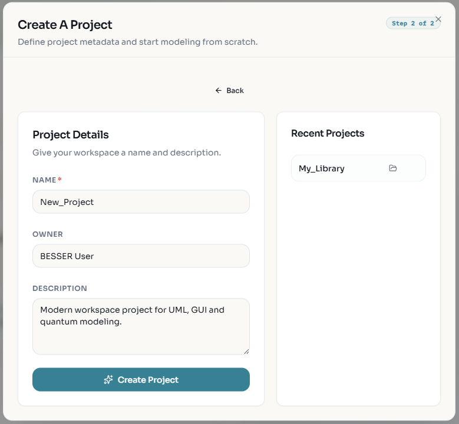
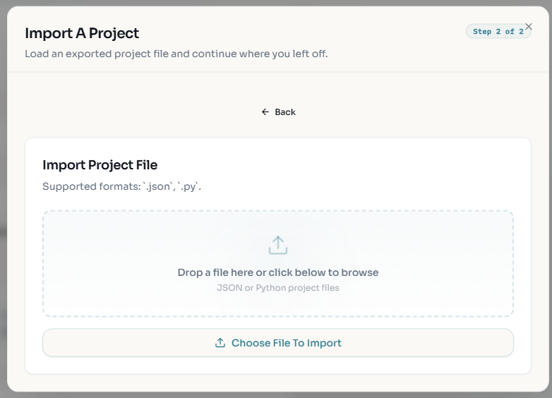
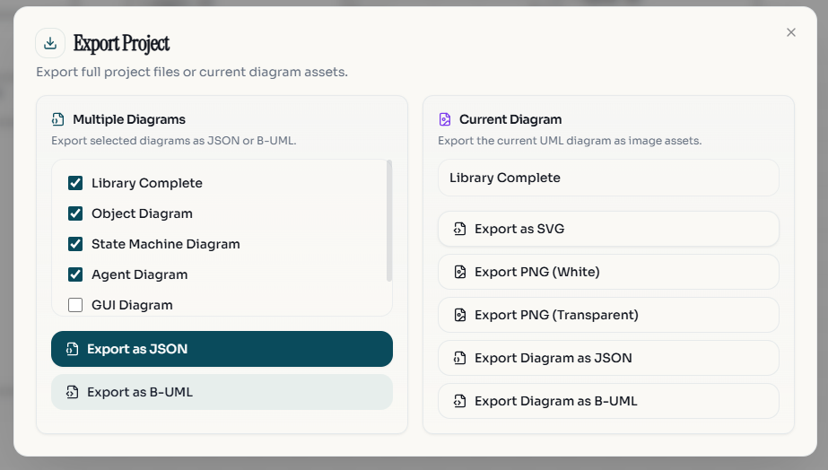
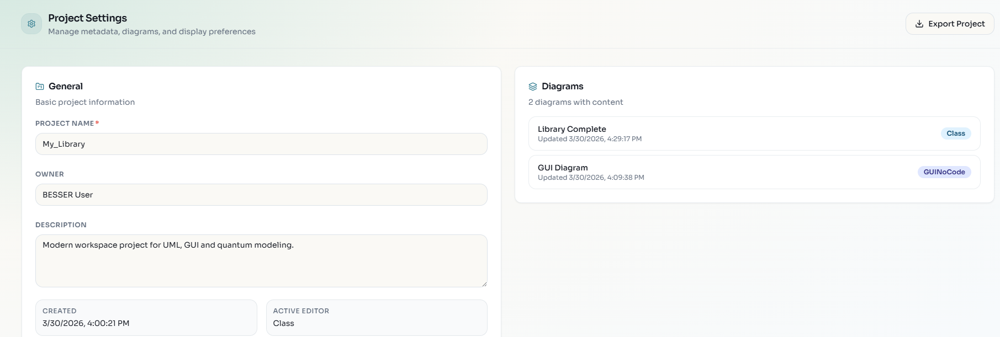

Project Management
==================

The Web Modeling Editor organizes your work into **Projects**. A project acts as a container for all your related diagrams, allowing you to manage complex systems effectively.

Projects live **in your browser** (``localStorage``, under keys prefixed
``besser_``). Nothing is stored on a BESSER server, so clearing site data
removes your projects — export or push to GitHub anything you want to keep.

The first thing you see
-----------------------

On a first visit the editor asks how you want to work:

* **Model it** — the low-code canvas: drag elements from the palette and edit
  them by hand.
* **Describe it** — the agentic workspace: the :doc:`AI assistant
  <ai-assistant>` opens next to the canvas and builds the model from your
  plain-language description.

Tick *Remember my choice* to skip the question next time (stored as
``besser_preferred_interface``). You can also force a mode with a URL
parameter: ``?agentic`` or ``?mode=agent`` opens the assistant workspace,
``?mode=model`` opens the low-code canvas. Either way the model is the same —
the choice only decides which surface opens first, and you can switch at any
time.

Choosing **More options** opens the project hub, which offers four ways to
start:

* **Create Blank** — an empty project with all editors available.
* **From Spreadsheet** — upload one or more ``.csv``, ``.xlsx`` or ``.xls``
  files and the backend derives a class diagram from them.
* **Import Project** — load an exported ``.json`` or a B-UML ``.py`` file.
* **Continue from GitHub** — reopen a repository BESSER generated earlier and
  keep building on it (see `Continuing from a GitHub repository`_).

Recently opened projects are listed underneath.

Creating a New Project
----------------------

1.  Click the **Home** icon 🏠 or select **File > New Project**.
2.  Enter the project details:
    *   **Name**: A descriptive name for your project.
    *   **Description**: (Optional) A brief summary of the project's purpose.
    *   **Owner**: The name of the project owner.
    *   **Default Diagram**: Select the initial diagram type to start with.
3.  Click **Create Project**.

Importing Projects
------------------

You can import existing projects to continue your work or use templates.

1.  Click **File > Import Project**.
2.  Select the file to import. Supported formats are:
    *   **B-UML (.py)**: The standard Python-based format for BESSER models.
    *   **JSON (.json)**: The internal format used by the web editor.

Importing always creates a **new** project — it never overwrites the one you
have open.

Individual diagrams can also be imported into the current project from the
**File** menu; those accept ``.json``, ``.py``, ``.bpmn`` and ``.xml``, and are
added as a new tab rather than replacing an existing diagram. Two AI-assisted
importers convert external material into a class diagram:

*   **Import Class Diagram from Image** (``.png``, ``.jpg``) — reads a picture
    of a class diagram.
*   **Import Class Diagram from KG** (``.json``, ``.ttl``, ``.rdf``) — reads a
    knowledge graph.

Both of these write into the **active** class diagram.

Diagram tabs
------------

Each diagram type has its own tab strip above the canvas, showing only the
diagrams of the type currently selected in the left sidebar.

*   **Add**: the ``+`` button creates another diagram of the active type. A
    project holds at most **five diagrams per type**; the button disappears at
    the cap.
*   **Rename**: double-click a tab, type, then Enter (Escape cancels).
*   **Delete**: the ``×`` on the tab. The last remaining diagram of a type
    cannot be closed.

Object and GUI No-Code diagrams additionally show a **Linked Diagrams** row
where you pick the class diagram they draw their types from; object diagrams get
a wand button that scaffolds objects from that class diagram. User diagrams show
a validation dot and an **Edit as Form** toggle that swaps the canvas for a
guided form.

Exporting Projects
------------------

To save your work or use it with other BESSER tools:

1.  Click **File > Export Project**.
2.  The dialog has two halves.

**Multiple diagrams** — tick the diagram types to include, then:

*   **Export as JSON**: the whole project as ``<Project_Name>.json``. This is
    the file the import flow reads back.
*   **Export as B-UML**: the whole project as a single ``<project>_besser.py``.

**Current diagram** — requires a UML diagram to be open:

*   **Export as SVG**
*   **Export PNG (White background)** / **Export PNG (Transparent)**
*   **Export Diagram as JSON**
*   **Export Diagram as B-UML** (the model is validated first)

Project Settings
----------------

You can modify project metadata at any time.

1.  Click the **Settings** icon ⚙️ in the sidebar.
2.  Update the Name, Description, or Owner.
3.  View the unique **Project ID**.

The settings page also holds:

*   **Display** — show instanced objects, show association names, properties
    panel, and the class-diagram notation switch (**UML** or **ER**; this
    changes rendering only, not the model).
*   **AI / LLM API Key** — see :doc:`ai-keys`.
*   **Diagrams** — which diagrams currently hold content, and when each changed.
*   **Modeling Perspectives** — which diagram types appear in the sidebar (see
    :doc:`diagrams/index`).

Language and theme are not here: the language selector and the light/dark toggle
live in the top bar.

GitHub Integration
------------------

The editor supports syncing projects with GitHub repositories, allowing version control
and collaboration on your models.

Connecting to GitHub
~~~~~~~~~~~~~~~~~~~~

1. Click the **GitHub** account button in the top bar (or **Sync** to open the
   GitHub panel on the right).
2. You are redirected to GitHub to authorise the BESSER OAuth app, and sent back
   to the editor signed in. A toast confirms *Signed in as …*.

The editor never sees your GitHub access token: the BESSER backend performs the
OAuth exchange, keeps the token server-side, and hands the browser only an
opaque session id. That session id is held in this browser tab
(``sessionStorage``) and expires after **24 hours**; your username is kept in
``localStorage`` for convenience. Sign out from the account dropdown in the top
bar.

Saving a Project to GitHub
~~~~~~~~~~~~~~~~~~~~~~~~~~

You can save your project to a new or existing GitHub repository:

- **New repository**: Click **Create Repository**, enter a name and description, then push. The editor
  creates the repo and commits your project JSON file.
- **Existing repository**: Click **Link Repository**, browse your repos, select one, choose a branch
  and file path, then push. The project JSON is saved to that location.

Each push creates a commit with your project data. The editor also exports raw B-UML Python files
(``domain_model.py``, ``agent_model.py``) into a ``buml/`` directory alongside the JSON, so your
project can be maintained even without the web editor.

Opening a Previously Synced Project
~~~~~~~~~~~~~~~~~~~~~~~~~~~~~~~~~~~~

To reopen a project that was saved to GitHub:

1. Open the GitHub panel in the sidebar.
2. Click **Link Repository** and select the repo and branch where your project is stored.
3. Browse the repository contents and select the ``.json`` project file.
4. Click **Pull** to load the project from GitHub into the editor.

The sync connection is remembered per project. Subsequent pushes go to the same repo/branch/file
without needing to relink.

Commit History
~~~~~~~~~~~~~~

The GitHub panel shows the last ten commits touching your project file, with
author, date and short SHA. Click any earlier commit to restore that version of
the project.

Auto-commit
~~~~~~~~~~~

Under **Settings** in the GitHub panel you can switch on auto-commit and pick an
interval (5, 10, 15, 30 or 60 minutes). It is off by default, needs a linked
repository, and skips ticks where nothing changed.

Sharing as a gist
~~~~~~~~~~~~~~~~~

**Share ▸ Create secret gist** publishes the project JSON as a GitHub gist —
secret by default — and opens it in a new tab.

Continuing from a GitHub repository
~~~~~~~~~~~~~~~~~~~~~~~~~~~~~~~~~~~

A repository that BESSER itself generated can be reopened from the project hub's
**Continue from GitHub** card. This imports the stored model as a new project and
links the repo, so the :doc:`Spec-Driven Agent <spec-driven-agent>` can keep
editing the application it built earlier.
