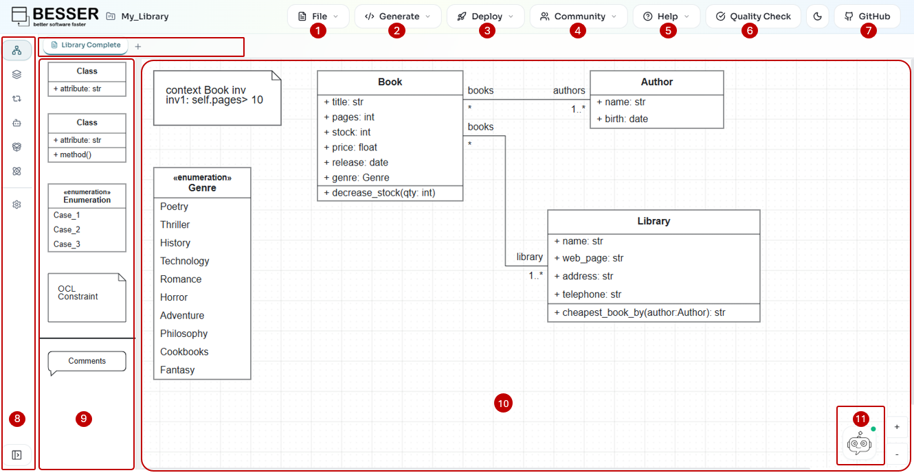

Using the Web Modeling Editor
=============================

This guide explains how to use the BESSER Web Modeling Editor.

Accessing the Editor
----------------------

You can access the BESSER Web Modeling Editor in two ways:

1. Public online version: Visit `editor.besser-pearl.org <https://editor.besser-pearl.org>`_ in your web browser
2. Local deployment: Deploy the editor locally by following the instructions in :doc:`./deploy_locally`

Dashboard Structure
-------------------

.. note::
   The BESSER Web Modeling Editor is organized around **projects**. Projects allow you to group related diagrams together, manage multiple models within a single workspace, and maintain better organization of your work. A project can contain multiple diagrams of each type.

The numbered elements in the interface are described below.

1. File Menu
~~~~~~~~~~~~

The *File* menu provides project and diagram management:

- *New / Open / Import Project*: Opens the project hub where you can create a blank project, build a class diagram from a spreadsheet, open a recent one, import an existing project, or continue from a GitHub repository. Diagram types available in a project: Class, Object, State Machine, Agent, User, GUI No-Code, Quantum Circuit, Neural Network and BPMN — up to five diagrams of each.
- *Load Template*: Start from one of the bundled templates (class-diagram patterns, agents, state machines, BPMN processes, neural networks, quantum circuits, or two complete example projects).
- *Export Project*: Export your project or the current diagram in B-UML, JSON, SVG or PNG format.
- *Import Diagram*: Add a single diagram to the current project from ``.json``, ``.py``, ``.bpmn`` or ``.xml``.
- *Import Class Diagram from Image*: Use AI to convert a picture of a class diagram into a model.
- *Import Class Diagram from KG*: Import a class diagram from a knowledge graph file (TTL/RDF/JSON).
- *Preview Project*: Preview the B-UML the project would export as.

2. Generate Menu
~~~~~~~~~~~~~~~~

Once your model is complete, use the *Generate* menu to produce code using the
`BESSER code generators <https://besser.readthedocs.io/en/latest/generators.html>`_.
Select a generator from the dropdown and the output will be downloaded to your machine.

3. Deploy Menu
~~~~~~~~~~~~~~

The *Deploy* menu lets you publish your generated application:

- **Connect GitHub to Deploy**: Sign in with GitHub (appears when not yet authenticated).
- **Publish Web App to Render**: Deploy the generated web application to
  `Render <https://render.com>`_ for cloud hosting. Requires a connected GitHub account.

4. Community Menu
~~~~~~~~~~~~~~~~~

The *Community* menu connects you with the BESSER community:

- **Contribute**: Opens the BESSER contribution guide on GitHub.
- **GitHub Repository**: Opens the BESSER GitHub repository.
- **Send Feedback**: Opens a feedback dialog to share your experience with the team.
- **User Evaluation Survey**: Opens an evaluation survey to help improve the editor.
- **Report a Problem**: Opens the GitHub issue tracker to report bugs.

5. Help Menu
~~~~~~~~~~~~

The *Help* menu provides guidance and information:

- **How does this editor work?**: Overview of the editor's features.
- **Start Tutorial**: Launches an interactive walkthrough of the editor.
- **Keyboard Shortcuts**: Displays available keyboard shortcuts.
- **About BESSER**: Information about the BESSER project.

6. Quality Check
~~~~~~~~~~~~~~~~

Click the **Quality Check** button to validate your model. The editor checks for
errors including duplicate class names, invalid OCL constraint syntax, and
structural model consistency. Validation results are displayed with specific
error messages.

7. GitHub and Utilities
~~~~~~~~~~~~~~~~~~~~~~~

The right side of the top bar provides quick-access utilities:

- **Theme toggle**: Switch between light and dark mode.
- **Star**: Star or unstar the BESSER GitHub repository (when signed in).
- **GitHub account**: Sign in or out of your GitHub account. Once authenticated,
  the Deploy menu becomes available.
- **Sync**: Synchronize your project with GitHub version control.

8. Left Sidebar
~~~~~~~~~~~~~~~

The left sidebar provides navigation and diagram management:

- **Diagram type tabs**: Switch between diagram types — Class, Object, State
  Machine, Agent, BPMN, User, Neural Network, GUI No-Code and Quantum Circuit.
  Types you have hidden through *Modeling Perspectives* do not appear here.
- **Diagram tabs**: Within each type, tabs above the canvas let you switch
  between diagrams of that type. The **+** button adds one (up to five per
  type); double-click a tab to rename it.
- **Agent Customization**: Expanding the Agent entry reveals the agent
  configuration page.
- **Settings**: Opens the project settings page.

9. Palette
~~~~~~~~~~

The palette contains the shapes and elements you can drag and drop onto the canvas. The available elements change depending on the active diagram type. For class diagrams, the palette includes:

- **Class** (with attributes only)
- **Class** (with attributes and methods)
- **Abstract Class**
- **Interface**
- **Enumeration**
- **OCL Constraint**

Other elements like Associations, Generalizations, and Association Classes are created by connecting elements directly on the canvas.

10. Canvas
~~~~~~~~~~

The canvas is the main drawing area where you design your model. You can:

- Drag elements from the palette onto the canvas.
- Connect elements by clicking and dragging from connection points.
- Double-click elements to edit their properties.
- Pan and zoom to navigate large diagrams.

11. AI Assistant
~~~~~~~~~~~~~~~~

The **Modeling Assistant** is the chat button in the bottom-right corner, or the
drawer that slides up over the canvas. Describe what you want in plain language
and it builds and edits the diagrams for you; ask it to generate and it either
runs a BESSER generator or hands the project to the Spec-Driven Agent, which
assembles a whole application. See :doc:`ai-assistant`,
:doc:`spec-driven-agent` and :doc:`ai-keys`.
